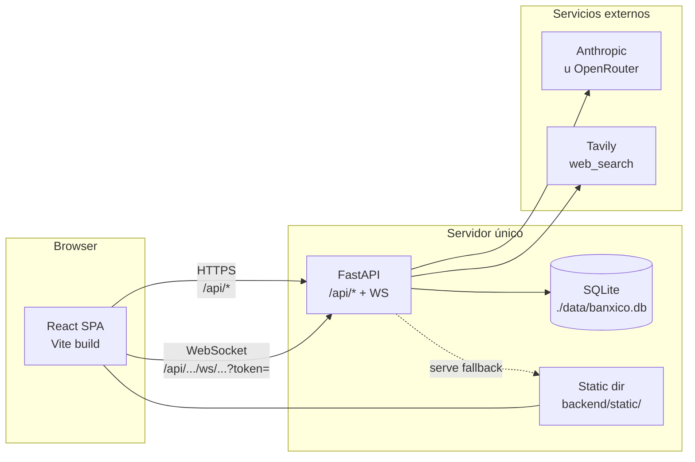
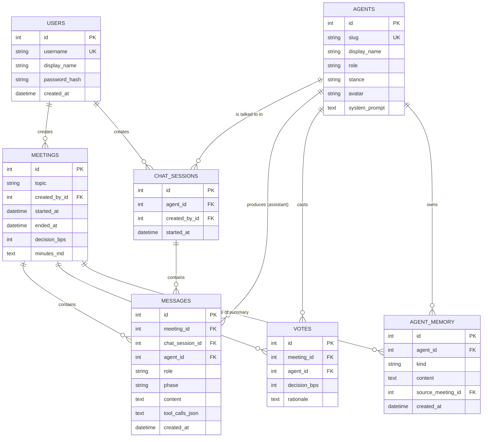
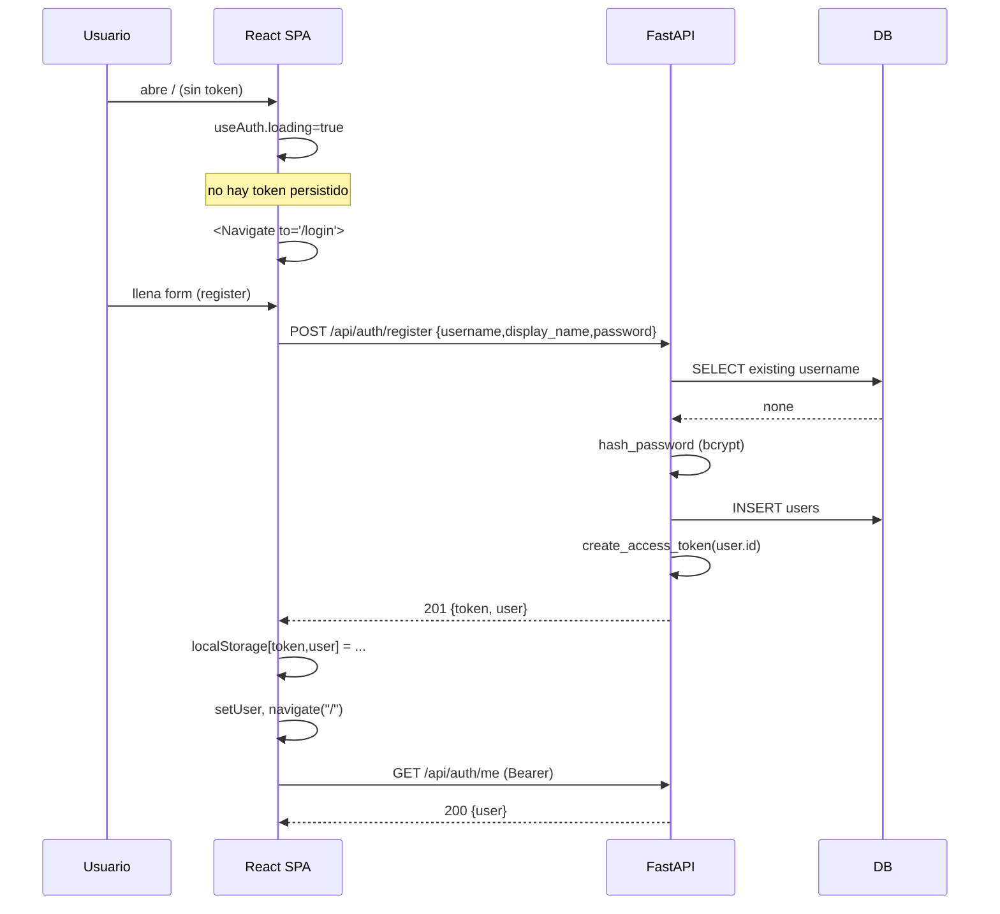
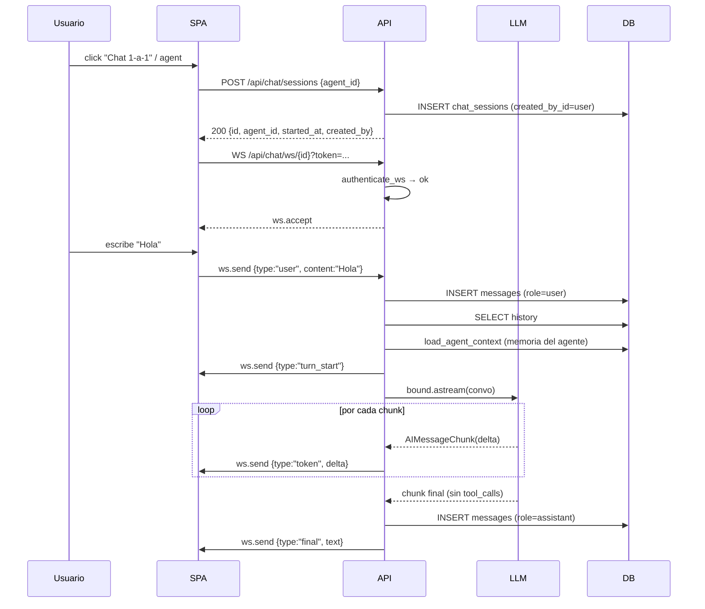
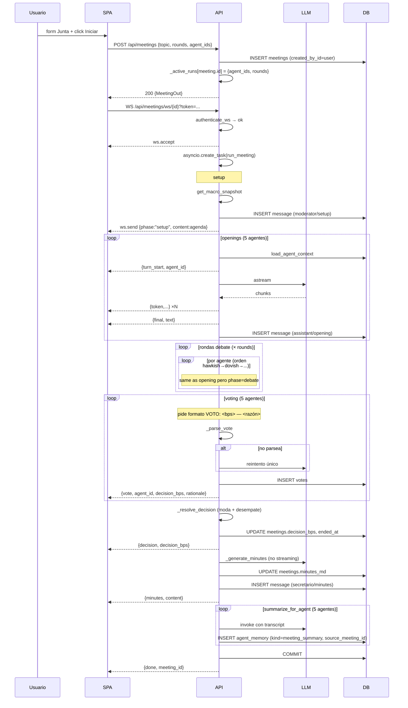

# Arquitectura del Simulador Banxico

Documento canónico que explica **cómo** funciona cada parte del proyecto. El `README.md` cubre el "cómo correrlo"; éste cubre el "cómo está hecho". Está pensado para onboarding del equipo y para contestar preguntas de profundidad sin tener que leer todo el código.

> Diagramas en Mermaid (renderizan en GitHub y VS Code). Si tu visor no los renderiza, todos están escritos como texto plano legible.

---

## Tabla de contenidos

1. [Resumen ejecutivo](#1-resumen-ejecutivo)
2. [Arquitectura de alto nivel](#2-arquitectura-de-alto-nivel)
3. [Stack tecnológico](#3-stack-tecnológico)
4. [Estructura del repositorio](#4-estructura-del-repositorio)
5. [Backend](#5-backend)
   - [5.1 Bootstrap y lifespan](#51-bootstrap-y-lifespan--backendappmainpy)
   - [5.2 Configuración](#52-configuración--backendappconfigpy)
   - [5.3 Base de datos](#53-base-de-datos--backendappdbpy)
   - [5.4 Modelos](#54-modelos--backendappmodelspy)
   - [5.5 Schemas Pydantic](#55-schemas-pydantic--backendappschemaspy)
   - [5.6 Autenticación](#56-autenticación--backendappauthpy)
   - [5.7 Rutas API](#57-rutas-api)
   - [5.8 Personas](#58-personas--backendapppersonaspy)
   - [5.9 Herramientas](#59-herramientas--backendapptoolspy)
   - [5.10 Memoria persistente](#510-memoria-persistente--backendappmemorypy)
   - [5.11 Agent runtime](#511-agent-runtime--backendappagent_runtimepy)
   - [5.12 Modo Chat 1-a-1](#512-modo-chat-1-a-1--backendappchatpy)
   - [5.13 Modo Junta](#513-modo-junta--backendappdebatepy)
   - [5.14 LLM factory](#514-llm-factory--backendappllmpy)
6. [Frontend](#6-frontend)
   - [6.1 Bootstrap](#61-bootstrap--frontendsrcmainttsx)
   - [6.2 App, ruteo y auth gate](#62-app-ruteo-y-auth-gate--frontendsrcappttsx)
   - [6.3 Auth context](#63-auth-context--frontendsrcauthttsx)
   - [6.4 Cliente API](#64-cliente-api--frontendsrcapits)
   - [6.5 Tipos](#65-tipos--frontendsrctypests)
   - [6.6 Páginas](#66-páginas)
   - [6.7 Componentes](#67-componentes)
   - [6.8 Estilos](#68-estilos)
   - [6.9 Vite proxy y same-origin](#69-vite-proxy-y-same-origin)
7. [Schema de base de datos](#7-schema-de-base-de-datos)
8. [Flujos end-to-end](#8-flujos-end-to-end)
9. [Protocolo WebSocket](#9-protocolo-websocket)
10. [Sistema de votación](#10-sistema-de-votación)
11. [Sistema de memoria](#11-sistema-de-memoria)
12. [Multi-usuario y registros](#12-multi-usuario-y-registros)
13. [Despliegue](#13-despliegue)
14. [Tests](#14-tests)
15. [Operaciones](#15-operaciones)
16. [Riesgos conocidos](#16-riesgos-conocidos)
17. [Glosario](#17-glosario)

---

## 1. Resumen ejecutivo

El simulador es una aplicación web que reproduce el funcionamiento de la Junta de Gobierno del Banco de México con cinco agentes basados en LLMs. Cada agente tiene una postura definida (centrista, hawkish, dovish, data-dependent, externo/FX) y participa en dos modos:

- **Chat 1-a-1**: una persona del equipo conversa con un solo miembro de la Junta. El agente puede usar herramientas (búsqueda web, snapshot macro, calculadora) y mantiene memoria persistente a través de sesiones.
- **Simulación de Junta**: cinco agentes debaten un tema, votan en bps (-50, -25, 0, +25, +50) y un Secretario emite minuta automática. Después de cada junta, cada agente guarda un resumen en primera persona.

La memoria es **compartida entre modos**: lo que un agente "vive" en una junta queda disponible cuando alguien le habla en chat después, y viceversa.

El sistema está pensado para correr como una sola instancia compartida por un equipo de hasta ~10 personas. Cada uno tiene cuenta con contraseña; todos pueden ver el registro completo de chats y juntas (read-only) con etiquetas de "creado por X".

---

## 2. Arquitectura de alto nivel



ASCII fallback:

```
Browser ──HTTP /api──▶ FastAPI ─▶ SQLite
        ──WebSocket──▶          ─▶ LLM provider (Anthropic / OpenRouter)
                                 ─▶ Tavily (búsqueda web)
                                 ─▶ Static dist/ (en producción Docker)
```

**Principio clave:** un solo origen en producción. La SPA buildeada se sirve desde la misma instancia FastAPI que la API, así que no hay CORS ni proxy en producción. En desarrollo, Vite proxyea `/api/*` (incluido WebSocket) al backend en `localhost:8000`.

---

## 3. Stack tecnológico

| Capa | Tecnología | Notas |
|---|---|---|
| Backend | Python 3.11+ | Tipado moderno (`Mapped[...]`, `from __future__ import annotations`) |
| Web framework | FastAPI | Lifespan, dependencies, WebSockets nativos |
| ORM | SQLAlchemy 2.0 | Estilo `Mapped`, `select(...)`, sin Alembic |
| DB | SQLite | Archivo en `./data/banxico.db`; cambiar a Postgres para escalar |
| Auth | JWT (`pyjwt`) + bcrypt | HS256, expira 30 días, header `Authorization: Bearer …` |
| LLM glue | LangChain (`langchain`, `langchain-anthropic`, `langchain-openai`) | Streaming nativo, `bind_tools`, `astream` |
| Web search | Tavily (`tavily-python`) | Opcional; fallback claro si falta key |
| Frontend | React 18 + TypeScript 5 + Vite 5 | StrictMode activado |
| Estilos | Tailwind CSS 3 + paleta `banxico-*` | `react-markdown` para renderizar minutas y respuestas |
| Estado servidor | TanStack Query (`@tanstack/react-query`) | `staleTime: 5s` global |
| Ruteo | `react-router-dom` v6 | `Routes`, `Navigate`, `useParams` |
| Tests | pytest + httpx (TestClient) | LLM real reemplazado por fakes monkeypatched |
| Despliegue | Docker multi-stage + docker-compose | Imagen única backend+frontend |

---

## 4. Estructura del repositorio

```
banxico_V3/
├── ARCHITECTURE.md            ← este documento
├── README.md                  ← guía rápida
├── Dockerfile                 ← build multi-stage (frontend → backend)
├── docker-compose.yml         ← un solo servicio
├── .dockerignore
├── backend/
│   ├── pyproject.toml         ← deps Python
│   ├── .env.example           ← template de configuración
│   ├── app/
│   │   ├── __init__.py
│   │   ├── main.py            ← FastAPI app, mount static, CORS
│   │   ├── config.py          ← Settings (pydantic-settings)
│   │   ├── db.py              ← engine, SessionLocal, init_db, get_session
│   │   ├── models.py          ← User, Agent, ChatSession, Meeting, Message, Vote, AgentMemory
│   │   ├── schemas.py         ← Pydantic In/Out
│   │   ├── auth.py            ← bcrypt hash, JWT, current_user, authenticate_ws
│   │   ├── personas.py        ← seed de los 5 agentes
│   │   ├── tools.py           ← get_macro_snapshot, calculator, web_search
│   │   ├── memory.py          ← append_memory, load_agent_context, extract_facts, summarize_for_agent
│   │   ├── agent_runtime.py   ← run_agent (loop tool-using con streaming)
│   │   ├── chat.py            ← handle_user_turn (modo 1-a-1)
│   │   ├── debate.py          ← run_meeting (modo junta) + parsing de votos
│   │   ├── llm.py             ← build_chat_model (Anthropic | OpenRouter)
│   │   └── routes/
│   │       ├── __init__.py
│   │       ├── auth.py        ← /api/auth/{register, login, me}
│   │       ├── agents.py      ← /api/agents/{list, get, memory}
│   │       ├── chat.py        ← /api/chat/{sessions, messages, ws}
│   │       └── meeting.py     ← /api/meetings/{create, list, get, ws}
│   ├── scripts/
│   │   └── verify_shared_memory.py  ← end-to-end live verification
│   └── tests/
│       ├── conftest.py        ← fixtures db_session, test_user, client, auth_headers
│       ├── test_auth.py
│       ├── test_memory.py
│       ├── test_personas.py
│       └── test_debate_smoke.py
└── frontend/
    ├── package.json
    ├── tsconfig.json
    ├── vite.config.ts
    ├── tailwind.config.js
    ├── postcss.config.js
    ├── index.html
    └── src/
        ├── main.tsx           ← createRoot + StrictMode + providers
        ├── App.tsx            ← rutas + AuthProvider + Header
        ├── auth.tsx           ← AuthContext, useAuth, getStoredToken
        ├── api.ts             ← jsonFetch (Bearer), openChatSocket, openMeetingSocket
        ├── types.ts           ← User, Agent, Meeting, ChatSessionSummary, WsEvent
        ├── index.css          ← Tailwind directives + .markdown utility
        ├── components/
        │   ├── AgentCard.tsx
        │   ├── MessageBubble.tsx
        │   ├── ToolCallTrace.tsx
        │   ├── VoteTally.tsx
        │   └── MinutesPanel.tsx
        └── pages/
            ├── LoginPage.tsx
            ├── HomePage.tsx
            ├── ChatPage.tsx
            └── MeetingPage.tsx
```

---

## 5. Backend

### 5.1 Bootstrap y lifespan — `backend/app/main.py`

**Propósito:** define la instancia `app` de FastAPI, monta CORS, registra los routers bajo el prefijo `/api`, y opcionalmente sirve el frontend buildeado en `backend/static/`.

**Componentes clave:**
- `lifespan(app)`: contexto async que llama `init_db()` al arrancar.
- `app = FastAPI(title="Banxico Sim", version="0.1.0", lifespan=lifespan)`.
- Llamada **redundante** a `init_db()` a nivel módulo (línea ~24): garantiza que `TestClient(app)` y otros entries que no ejecutan `lifespan` también vean DB poblada con personas.
- `CORSMiddleware` con `allow_origins=settings.cors_origins_list or ["*"]` — útil solo si frontend y backend están en orígenes distintos.
- `GET /health` (sin auth, sin prefijo `/api`): para liveness probes en Docker/cloud.
- `app.include_router(<router>, prefix="/api")` × 4 (auth, agents, chat, meeting).
- **SPA fallback**: si existe `backend/static/index.html`, monta `/assets` como `StaticFiles` y agrega un route `GET /{full_path:path}` que sirve `index.html` para cualquier URL no-API. Esto soporta ruteo client-side de React Router.

**Por qué el orden importa:** los routers `/api/*` se incluyen **antes** del catch-all SPA, así que `/api/agents` siempre va al router, no al `index.html`.

### 5.2 Configuración — `backend/app/config.py`

**Propósito:** centralizar todas las variables de entorno usando `pydantic-settings`.

Todas las configuraciones tienen defaults sensatos (`Settings` clase). Se pueden sobreescribir vía `.env` o variables de entorno OS. La instancia `settings` es global (singleton de módulo).

| Variable | Default | Significado |
|---|---|---|
| `PROVIDER` | `"anthropic"` | `anthropic` o `openrouter` |
| `MODEL` | `"claude-sonnet-4-6"` | Slug del modelo (debe ser slug de OpenRouter cuando el provider es OpenRouter, ej. `anthropic/claude-sonnet-4.6`) |
| `ANTHROPIC_API_KEY` | `""` | Solo si `PROVIDER=anthropic` |
| `OPENROUTER_API_KEY` | `""` | Solo si `PROVIDER=openrouter` |
| `TAVILY_API_KEY` | `""` | Opcional; sin esta key, `web_search` devuelve un mensaje claro y los agentes siguen usando otras tools |
| `DATABASE_URL` | `"sqlite:///./banxico.db"` | URL SQLAlchemy. En Docker se mueve a `sqlite:////app/data/banxico.db` (volumen persistente) |
| `CORS_ORIGINS` | `"http://localhost:5173"` | Lista separada por comas |
| `JWT_SECRET` | `"dev-only-change-me"` | **Cambiar en producción**. Generar con `openssl rand -hex 32` |
| `JWT_EXPIRES_HOURS` | `720` | 30 días |
| `ALLOW_REGISTRATION` | `True` | `False` cierra `POST /api/auth/register` con 403 |

**Helper:** `settings.cors_origins_list` parsea el string en lista de strings limpios.

### 5.3 Base de datos — `backend/app/db.py`

**Propósito:** punto único de creación del engine y de la sesión SQLAlchemy.

Componentes:
- `class Base(DeclarativeBase)`: base para todos los modelos.
- `engine = create_engine(DATABASE_URL, connect_args={"check_same_thread": False} if sqlite else {}, future=True)`: el `check_same_thread=False` es necesario porque FastAPI crea threads para requests sync; SQLite por defecto solo permite usar la conexión desde el thread que la creó.
- `SessionLocal = sessionmaker(bind=engine, autoflush=False, autocommit=False, expire_on_commit=False, future=True)`. `expire_on_commit=False` es importante: permite que objetos sigan vivos tras commit (los WebSocket handlers commitean y luego siguen usando los objetos para `emit`).
- `init_db()`: importa `models` (registra tablas), llama `Base.metadata.create_all(bind=engine)` (crea tablas faltantes; **nunca migra columnas existentes**) y ejecuta `seed_personas()` para garantizar los 5 agentes.
- `get_session()`: dependency FastAPI estándar (yield + close).
- `session_scope()`: contexto manual (commit en éxito, rollback en error). No se usa actualmente en la app principal pero es útil para scripts.

**Decisión deliberada: sin Alembic.** El simulador es un MVP para 10 personas; los cambios de schema durante desarrollo se manejaron con drop-and-recreate (`rm banxico.db && uvicorn ...`). Cuando este sea producción estable, considerar agregar Alembic.

### 5.4 Modelos — `backend/app/models.py`

**Tablas:** 7 modelos. Todas heredan de `Base`. Ver [§7 Schema de base de datos](#7-schema-de-base-de-datos) para el ERD completo y descripción tabla por tabla.

Resumen rápido:

| Modelo | Tabla | FKs hacia | Propósito |
|---|---|---|---|
| `User` | `users` | — | Cuentas humanas |
| `Agent` | `agents` | — | Los 5 personajes IA (sembrados al arranque) |
| `ChatSession` | `chat_sessions` | `agents`, `users` | Una conversación 1-a-1 |
| `Meeting` | `meetings` | `users` | Una junta |
| `Message` | `messages` | `meetings`, `chat_sessions`, `agents` | Mensaje individual; `meeting_id` o `chat_session_id` está poblado, no ambos |
| `Vote` | `votes` | `meetings`, `agents` | Voto de un agente en una junta |
| `AgentMemory` | `agent_memory` | `agents`, `meetings` (opcional) | Hechos y resúmenes que el agente recuerda |

Detalle de relaciones:
- `Meeting.creator` y `ChatSession.creator`: `relationship("User", foreign_keys=[created_by_id])`. Permiten cargar el creador con un join.
- `Meeting.votes` y `Meeting.messages`: `relationship(...cascade="all, delete-orphan")`. Si borraras una junta, sus votos y mensajes desaparecen con ella.
- `ChatSession.agent`: relación al agente con quien chatea.

Las columnas `created_at`/`started_at` usan `server_default=func.now()` (SQL `CURRENT_TIMESTAMP`), no Python `datetime.utcnow()`, así que el reloj autoritativo es el de la DB.

### 5.5 Schemas Pydantic — `backend/app/schemas.py`

**Propósito:** definir los DTOs que cruzan la frontera HTTP/JSON. Hay tres tipos:

- **`...In`** (input): payloads que llegan en el body. `RegisterIn`, `LoginIn`, `ChatSessionCreate`, `MeetingCreate`. Tienen validación con `Field(min_length=...)`.
- **`...Out`** (output detallado): `MeetingOut` con votes y messages embebidos, `ChatSessionOut` con creator. Usados en respuestas de un solo recurso.
- **`...Summary`** (output ligero): `MeetingSummary`, `ChatSessionSummary`. Usados en listados.

Todos los `Out`/`Summary` con `class Config: from_attributes = True` aceptan ORM objects directamente vía `Schema.model_validate(orm_obj)`.

**Mapping con frontend `types.ts`:** ver [§6.5 Tipos](#65-tipos--frontendsrctypests) — el frontend duplica estas formas en TypeScript. Si cambias un schema aquí, actualiza también el tipo equivalente.

### 5.6 Autenticación — `backend/app/auth.py`

**Funciones expuestas:**
- `hash_password(password) → str`: bcrypt con salt fresco. **Trunca explícitamente el password a 72 bytes** (`_truncate`) — bcrypt 5.x lanza si recibe más; antes pasaba en silencio.
- `verify_password(password, hashed) → bool`: trunca igual al verificar; cualquier excepción se considera password inválido.
- `create_access_token(user_id) → str`: JWT HS256 con `sub` (string del id), `iat`, `exp` (now + `JWT_EXPIRES_HOURS`).
- `decode_access_token(token) → int`: regresa `user_id`. Cualquier error (firma inválida, expirado, sub no entero) lanza `HTTPException(401)`.
- `current_user(authorization, session)`: dependency FastAPI. Extrae el Bearer del header `Authorization`, decodifica, busca el `User` en DB. Falla con 401 si falta header, formato inválido, JWT inválido, o usuario no encontrado.
- `authenticate_ws(ws, token) → User | None`: para WebSockets. **Antes del `accept`** valida el token (que viene como `?token=...` query). Si falla cierra con código `4401` (custom para "auth failed") y regresa `None`. El caller debe revisar el regreso y abortar si es `None`. Devuelve el `User` con `session.expunge` para que pueda usarse fuera de la sesión que lo cargó.

**Decisión: bcrypt directo, no passlib.** Originalmente usábamos `passlib[bcrypt]` pero la versión 1.7 de passlib es incompatible con bcrypt 5.x (intenta leer un atributo `__about__` que ya no existe y falla con el limit de 72 bytes). Cambiar a `bcrypt` directo simplifica todo.

### 5.7 Rutas API

Todas las rutas (excepto `GET /health`) viven bajo el prefijo `/api`. Tabla completa:

| Método | Path | Auth | Body | Devuelve | Archivo |
|---|---|---|---|---|---|
| GET | `/health` | no | — | `{ok, provider, model}` | main.py |
| POST | `/api/auth/register` | no | `{username, display_name, password}` | `{token, user}` 201 | routes/auth.py |
| POST | `/api/auth/login` | no | `{username, password}` | `{token, user}` | routes/auth.py |
| GET | `/api/auth/me` | sí | — | `User` | routes/auth.py |
| GET | `/api/agents` | sí | — | `Agent[]` | routes/agents.py |
| GET | `/api/agents/{id}` | sí | — | `Agent` | routes/agents.py |
| GET | `/api/agents/{id}/memory` | sí | — | `MemoryItem[]` (DESC) | routes/agents.py |
| POST | `/api/chat/sessions` | sí | `{agent_id}` | `ChatSessionOut` | routes/chat.py |
| GET | `/api/chat/sessions` | sí | — | `ChatSessionSummary[]` | routes/chat.py |
| GET | `/api/chat/sessions/{id}/messages` | sí | — | `Message[]` | routes/chat.py |
| WS | `/api/chat/ws/{id}?token=` | sí (token query) | `{type:"user", content}` | eventos | routes/chat.py |
| POST | `/api/meetings` | sí | `{topic, rounds, agent_ids?}` | `MeetingOut` | routes/meeting.py |
| GET | `/api/meetings` | sí | — | `MeetingSummary[]` | routes/meeting.py |
| GET | `/api/meetings/{id}` | sí | — | `MeetingOut` | routes/meeting.py |
| WS | `/api/meetings/ws/{id}?token=` | sí (token query) | — (puramente lectura) | eventos | routes/meeting.py |

**Auth en agents:** el router `agents` se incluye con `dependencies=[Depends(current_user)]`, así que **todos** sus endpoints requieren auth aunque no usen el user explícitamente.

**Auth en WebSockets:** el token viaja en query (`?token=...`) porque los headers no se pueden setear en `new WebSocket(url)` desde el browser. Antes de `await ws.accept()` se llama `authenticate_ws(ws, token)`. Si falla, el handshake se cierra con código 4401 y el browser ve un close inmediato.

### 5.8 Personas — `backend/app/personas.py`

**Propósito:** definir las 5 personalidades de la Junta y sembrarlas en `agents` al arranque.

Estructura de cada persona (lista `PERSONAS`):
```python
{
  "slug": "subg_halcon",
  "display_name": "Subgobernador Aguirre",
  "role": "Subgobernador",
  "stance": "hawkish",
  "avatar": "🦅",
  "system_prompt": f"{COMMON_STYLE}\n\nEres el miembro hawkish de la Junta...\n\n{VOTE_INSTRUCTION}",
}
```

Las 5 personas:

| slug | display_name | stance | avatar | Resumen de postura |
|---|---|---|---|---|
| `gobernadora` | Gobernadora Méndez | centrista | 🏛️ | Buscar consenso; convergencia al 3%; movimientos graduales |
| `subg_halcon` | Subgobernador Aguirre | hawkish | 🦅 | Ancla nominal sobre actividad; tasas restrictivas más tiempo |
| `subg_paloma` | Subgobernadora Robles | dovish | 🕊️ | Brecha del producto y empleo; favorece recortar |
| `subg_datos` | Subgobernador Carrillo | data-dependent | 📊 | Decisión a decisión; cita series específicas |
| `subg_externo` | Subgobernadora Vega | externo/FX | 🌐 | Diferencial con la Fed, USD/MXN, flujos |

**Bloques compartidos en cada system_prompt:**
- `COMMON_STYLE`: español formal, vocabulario técnico, citar fuentes con `web_search`, conciso (~200 palabras), no inventar cifras.
- `VOTE_INSTRUCTION`: formato exacto del voto (`VOTO: <bps> — <razón breve>`). Crítico para que `_parse_vote` lo extraiga.

`seed_personas(session)` es **idempotente**: si el slug ya existe actualiza los campos; si no, inserta. Esto permite cambiar prompts y reiniciar sin perder DB.

### 5.9 Herramientas — `backend/app/tools.py`

Tres herramientas LangChain (`@tool`) que los agentes pueden invocar via tool-use:

#### `get_macro_snapshot()` → `dict`
Devuelve un snapshot **estático embebido** de variables macro mexicanas (tasa Banxico 9.00%, Fed funds 4.50%, INPC 4.10% YoY, subyacente 3.85%, expectativas 12m 3.80%, USD/MXN 18.20, PIB 1.40% YoY, desempleo 2.80%, fecha 2026-04-25). Está marcado como ilustrativo. Cuando se requiera datos en vivo, conectar a INEGI / Banxico SIE (TODO comentado en el código).

#### `calculator(expression: str)` → `str`
Evalúa una expresión aritmética con `numexpr` (acepta `+`, `-`, `*`, `/`, `**`, paréntesis). Devuelve string del resultado. Si falla, devuelve `"calculator error: <msg>"` (no lanza).

#### `web_search(query: str)` → `str`
Si `TAVILY_API_KEY` está vacía, devuelve `"web_search no disponible: configurar TAVILY_API_KEY en el backend."`. Si está presente, llama `TavilySearchResults(max_results=5)` de `langchain_community.tools` y formatea hasta 5 resultados como `- <título>\n  <url>\n  <extracto recortado a 400 chars>`.

`ALL_TOOLS` exporta la lista completa; `tools_by_name()` da el dict para resolver llamadas por nombre desde el agent runtime.

### 5.10 Memoria persistente — `backend/app/memory.py`

**Propósito:** mantener una memoria por agente (no por usuario, no por sesión) con dos tipos de items: `fact` (hechos durables que aprendió en chats) y `meeting_summary` (resumen en primera persona de cada junta en la que participó). La memoria se inyecta como `SystemMessage` adicional al inicio de cada turno del agente, así que **el mismo agente "recuerda" en chat lo que hizo en una junta** y viceversa.

Funciones:

#### `append_memory(session, agent_id, kind, content, source_meeting_id=None) → AgentMemory`
Inserta una fila en `agent_memory`. Hace `session.flush()` (no commit). El caller decide cuándo commitear.

#### `load_agent_context(session, agent_id, k_meetings=3, k_facts=10) → str`
Construye un bloque de texto formateado con la memoria del agente. Incluye:
- Header con nombre y postura del agente.
- Hasta `k_meetings` resúmenes de juntas (más recientes primero, con fecha).
- Hasta `k_facts` hechos personales (más recientes primero).
- Si no hay nada: línea "(Sin memoria previa; ésta es tu primera intervención registrada.)".
- Footer instruccional: "Usa esta memoria para mantener consistencia con tus posturas y declaraciones previas."

Si el agente no existe, devuelve `""`.

#### `summarize_for_agent(session, agent_id, meeting_id, transcript) → AgentMemory | None`
Llama al LLM (no streaming, `temperature=0.2`) para generar un resumen en primera persona desde la perspectiva del agente. Pasa el system prompt "Eres {display_name}…" + transcripción completa de la junta. El resultado se persiste como `kind='meeting_summary'` con `source_meeting_id` poblado.

#### `extract_facts(session, agent_id, recent_messages) → list[AgentMemory]`
Llama al LLM (`temperature=0.1`) pidiendo hasta 3 hechos durables del chat reciente. El prompt instruye:
- Una línea por hecho, sin viñetas.
- Máximo 25 palabras cada uno.
- Si no hay nada útil, responder exactamente `NONE`.

Parsea línea por línea, descarta líneas <6 chars, persiste el resto como `kind='fact'`.

**Quién llama qué:**
- `chat.py:52` → `load_agent_context` (en cada turno).
- `chat.py:81` → `extract_facts` (cada 6 mensajes de usuario).
- `debate.py:146` → `load_agent_context` (en cada `_agent_turn` — opening, debate, vote).
- `debate.py:126` → `summarize_for_agent` (al final de cada junta, una vez por agente).

Ver [§11 Sistema de memoria](#11-sistema-de-memoria) para el deep dive con ejemplos concretos.

### 5.11 Agent runtime — `backend/app/agent_runtime.py`

**Propósito:** ejecutar un loop de "tool-using agent" con streaming. Tanto chat como junta lo usan.

**Función pública:**
```python
async def run_agent(model, messages, *, emit=None, use_tools=True, max_iters=4) -> RunResult
```

**Algoritmo:**
1. Si `use_tools=True`, llama `model.bind_tools(ALL_TOOLS)` para que el LLM pueda emitir tool_calls.
2. Hasta `max_iters` veces:
   - `bound.astream(convo)` produce `AIMessageChunk` deltas.
   - Para cada chunk, suma a `gathered` y emite `{"type":"token", "delta": chunk.content}` (string deltas) o iterando `content_blocks` (Anthropic structured content).
   - Si el chunk final tiene `tool_calls`, ejecuta cada tool con `tool.invoke(args)`, emite `tool_start` antes y `tool_end` después con el output (o un mensaje de error si falla), y agrega `ToolMessage` al convo.
   - Si no hay tool_calls, marca como respuesta final.
3. Al terminar emite `{"type":"final", "text": final_text}` y devuelve `RunResult(text, tool_calls, messages)`.

**Helpers:**
- `_content_text`: aplana content que puede ser str o lista de blocks (para Anthropic structured).
- `_normalize_content`: pass-through, mantiene la forma original.

**Detalle de streaming:** los chunks se emiten como deltas tan pronto como llegan. La frontend los acumula en un bubble. Ver el bug histórico de duplicación en [§16.5](#165-react-strictmode--updaters-mutables).

### 5.12 Modo Chat 1-a-1 — `backend/app/chat.py`

**Propósito:** procesar un turno del usuario en un chat 1-a-1.

**Función pública:**
```python
async def handle_user_turn(session, chat_session_id, user_text, emit) -> Message
```

**Pasos:**
1. Cargar `ChatSession` y `Agent` por foreign key.
2. Persistir el mensaje del usuario (`role='user'`, `chat_session_id=...`).
3. Cargar todos los mensajes anteriores de la sesión (ordenados por `created_at, id`).
4. Construir convo: `[SystemMessage(agent.system_prompt), SystemMessage(load_agent_context(...))?, ...history...]`. La memoria se inyecta como segundo system message — antes del historial.
5. Emitir `{type:"turn_start", agent_id, agent}`.
6. Construir el modelo (`build_chat_model(streaming=True)`) y delegar a `run_agent(model, convo, emit)`.
7. Persistir la respuesta del asistente con `tool_calls_json` si hubo.
8. Cada `FACT_EXTRACTION_EVERY = 6` mensajes de usuario, llamar `extract_facts` con los últimos 12 mensajes + el nuevo turno. **Envuelto en try/except con `log.exception`**: la extracción es best-effort y un fallo del LLM no debe romper el turno. Los errores quedan en logs de uvicorn.
9. `session.commit()` y devolver el `Message` del asistente.

**Quién la llama:** `routes/chat.py` desde el WebSocket handler (`chat_ws`), una vez por mensaje recibido del cliente.

### 5.13 Modo Junta — `backend/app/debate.py`

**Propósito:** orquestar una junta completa: setup, openings, rondas de debate, votación, decisión, minuta y memoria por agente.

**Función pública:**
```python
async def run_meeting(session, meeting_id, rounds, agent_ids, emit) -> Meeting
```

**Fases (cada una emite eventos por WS):**

1. **Setup** (`phase: "setup"`):
   - Llama `get_macro_snapshot.invoke({})` para datos macro.
   - Construye una agenda con tema + snapshot + lista de asistentes.
   - Persiste un `Message` con `role='moderator'`, `phase='setup'`.
   - Emite `{type:"phase", phase:"setup", content:agenda}`.

2. **Openings** (`phase: "opening"`):
   - Para cada agente, llama `_agent_turn(...)` con instrucción "Da tu posición INICIAL... no votes todavía".
   - `_agent_turn` carga `load_agent_context`, ejecuta `run_agent` con streaming, persiste el mensaje, devuelve el texto. Cada chunk se relé con `agent_id`/`agent`/`phase` agregados.
   - Acumula textos en `transcript` (lista de strings).

3. **Cross-talk rounds** (`phase: "debate"`):
   - Hasta `rounds` (1-4) iteraciones.
   - `_pick_speakers_order`: ordena por prioridad de stance (hawkish→dovish→centrista→data-dependent→externo).
   - Cada agente reacciona al debate hasta ese punto, máx 180 palabras.

4. **Voting** (`phase: "vote"`):
   - Para cada agente: `_collect_vote(...)` pide la línea con formato `VOTO: <bps> — <razón>`.
   - Si `_parse_vote` no lo encuentra, **un único reintento** con énfasis en el formato.
   - Si tampoco, fallback `(0, "Voto no parseable; se asume mantener (default).")`.
   - Crea fila en `votes` table.
   - Emite `{type:"vote", agent_id, agent, decision_bps, rationale}`.

5. **Decisión**:
   - `_resolve_decision(votes, agents)`: gana la moda (modo más votado). Si hay empate, el voto de `subg_gobernadora` (slug `gobernadora`) rompe si está entre los empatados; si no, fallback al más conservador (`min(tied, key=lambda x: (abs(x), x))`).
   - Persiste en `meeting.decision_bps` y `meeting.ended_at = utcnow()`.
   - Emite `{type:"decision", decision_bps}`.

6. **Minuta** (`phase: "minutes"`):
   - `_generate_minutes` llama al LLM (no streaming, `temperature=0.2`) con prompt de Secretario: "Markdown con secciones Contexto, Posiciones por miembro, Discusión, Votación (tabla), Decisión final, Riesgos. Máx 600 palabras."
   - Persiste en `meeting.minutes_md` y como `Message(role='secretario', phase='minutes')`.
   - Emite `{type:"minutes", content}`.

7. **Per-agent memory** (no emite):
   - Para cada agente participante, llama `summarize_for_agent` con la transcripción completa.
   - Envuelto en try/except con `log.exception` — best-effort.

8. **Fin**:
   - `session.commit()` final.
   - Emite `{type:"done", meeting_id}`.

**Helpers privados:**
- `_persist_message`, `_agent_turn`, `_collect_vote`, `_parse_vote`, `_resolve_decision`, `_generate_minutes`, `_pick_speakers_order`.
- `VOTE_REGEX = r"VOTO\s*:\s*([+\-]?\d{1,3})\s*(?:bps)?\s*[—\-:]\s*(.+)"`.
- `ALLOWED_BPS = {-50, -25, 0, 25, 50}`. Si el LLM emite un valor fuera (ej. `-30`), `_parse_vote` redondea al permitido más cercano.

Ver [§10 Sistema de votación](#10-sistema-de-votación) para análisis profundo del parsing y desempate.

### 5.14 LLM factory — `backend/app/llm.py`

**Propósito:** una función única `build_chat_model(streaming=True, temperature=0.4)` que devuelve un `BaseChatModel` listo según `settings.PROVIDER`.

```python
if PROVIDER == "anthropic":
    return ChatAnthropic(model=MODEL, api_key=ANTHROPIC_API_KEY, streaming=..., temperature=..., max_tokens=2048)

if PROVIDER == "openrouter":
    return ChatOpenAI(
        model=MODEL,                           # ej. "anthropic/claude-sonnet-4.6"
        base_url="https://openrouter.ai/api/v1",
        api_key=OPENROUTER_API_KEY,
        streaming=..., temperature=..., max_tokens=2048,
        default_headers={"HTTP-Referer": "http://localhost:5173", "X-Title": "Banxico Sim"},
    )
```

Falla con `RuntimeError` claro si la key correspondiente está vacía.

**Por qué OpenAI client para OpenRouter:** OpenRouter expone su API en formato OpenAI-compatible. `ChatOpenAI` de `langchain_openai` con `base_url` redirigido funciona out-of-the-box, incluyendo streaming y `bind_tools`.

---

## 6. Frontend

### 6.1 Bootstrap — `frontend/src/main.tsx`

`createRoot(...).render(<StrictMode><QueryClientProvider><BrowserRouter><App/></BrowserRouter></QueryClientProvider></StrictMode>)`.

`QueryClient` con `defaultOptions: { queries: { staleTime: 5_000 } }` — caches de listados se revalidan cada 5 segundos.

**StrictMode activado**: en desarrollo, React ejecuta dobles los effects, los renderers y los `setState` updaters para detectar impurezas. Esto fue el origen del bug histórico de duplicación de texto — ver [§16.5](#165-react-strictmode--updaters-mutables).

### 6.2 App, ruteo y auth gate — `frontend/src/App.tsx`

Estructura:

```tsx
<AuthProvider>
  <Header />
  <main><AppRoutes /></main>
</AuthProvider>
```

**`Header`**: usa `useAuth()`. Si hay `user`, muestra `display_name` y botón "Salir"; si no, solo el título. Los enlaces de navegación (Inicio, Chat, Junta) solo aparecen autenticado.

**`RequireAuth`**: HOC que envuelve rutas protegidas. Si `loading`, muestra "Cargando…"; si no hay `user`, redirige a `/login` con `state.from`.

**Rutas:**
| Path | Componente | Notas |
|---|---|---|
| `/login` | `LoginPage` (sin RequireAuth) | Si ya hay user, redirige a `/` |
| `/` | `HomePage` | RequireAuth |
| `/chat` | `ChatPage` (modo new, agente default) | RequireAuth |
| `/chat/:agentId` | `ChatPage` (modo new, agente específico) | RequireAuth |
| `/chat/session/:sessionId` | `ChatPage` (modo existing) | RequireAuth |
| `/meeting` | `MeetingPage` (configuración nueva) | RequireAuth |
| `/meeting/:meetingId` | `MeetingPage` (cargar existente) | RequireAuth |

### 6.3 Auth context — `frontend/src/auth.tsx`

Contexto React que expone `{ user, token, loading, login, register, logout }`.

- **Persistencia**: `localStorage.banxico.token` y `localStorage.banxico.user` (JSON).
- **Hidratación**: al montar, si hay token persistido, llama `GET /api/auth/me` para validarlo. Si responde 200, refresca user. Si falla, limpia ambos.
- **Listener global `auth:unauthorized`**: el `api.ts` despacha este evento cuando un fetch responde 401. El context lo escucha y limpia el state, lo que provoca que `RequireAuth` redirija a login.
- `login(username, password)` y `register(username, display_name, password)` postean a `/api/auth/{login,register}` y guardan en localStorage + state.
- `logout()` limpia localStorage + state.
- `getStoredToken()`: helper exportado fuera del provider (lo usa `api.ts`) para leer el token desde localStorage sin pasar por el contexto.

### 6.4 Cliente API — `frontend/src/api.ts`

**`jsonFetch<T>(path, init?)`**: wrapper de `fetch`. Inyecta `Content-Type: application/json` y `Authorization: Bearer ...` (si hay token). Trata 401 globalmente: dispara `auth:unauthorized` y lanza `Error("No autorizado")`. Otros errores: lanza `Error(HTTP <status>: <body>)`.

**`api`** (objeto con métodos): wrappers tipados sobre `jsonFetch`:
- `listAgents`, `getAgentMemory(id)` — `/api/agents`
- `createChatSession(agent_id)`, `listChatSessions()`, `listChatMessages(sid)` — `/api/chat`
- `createMeeting(topic, rounds, agent_ids?)`, `listMeetings()`, `getMeeting(id)` — `/api/meetings`

**WebSocket helpers:**
- `wsUrl(path)`: construye `ws://localhost:5173/api${path}?token=<encoded_token>`. Usa `wss` si la página es HTTPS. La sesión Vite proxyea a `ws://localhost:8000/api${path}`.
- `openChatSocket(sessionId, onEvent)`: abre `/api/chat/ws/{sessionId}?token=...`.
- `openMeetingSocket(meetingId, onEvent)`: abre `/api/meetings/ws/{meetingId}?token=...`.
- Ambos asignan `ws.onmessage` que parsea JSON y llama `onEvent`. Errores de parsing se ignoran silenciosamente.

### 6.5 Tipos — `frontend/src/types.ts`

Interfaces TypeScript que duplican los schemas Pydantic. Los más importantes:

- `User`, `Agent`, `MemoryItem`, `Message`, `Vote`
- `ChatSession`, `ChatSessionSummary`
- `Meeting`, `MeetingSummary`
- **`WsEvent`**: discriminated union por `type`. Es la fuente de verdad para todos los eventos que viajan por WebSocket. Incluye `turn_start`, `token`, `tool_start`, `tool_end`, `final`, `phase`, `vote`, `decision`, `minutes`, `done`, `error`.

Ejemplo de un evento token:
```typescript
{ type: "token"; delta: string; agent_id?: number; agent?: string; phase?: string }
```

### 6.6 Páginas

#### `LoginPage.tsx`
Formulario único con toggle login/register. Estado local `mode`, `username`, `displayName`, `password`, `error`, `busy`. Al submit llama `login` o `register` del contexto, redirige a `/` en éxito. Validaciones HTML5 (`required`, `minLength`).

#### `HomePage.tsx`
Dashboard del registro compartido. Layout:
- Texto de introducción + dos CTAs (Chat 1-a-1, Junta).
- **Dos secciones lado a lado** (`grid lg:grid-cols-2`):
  - **Juntas previas**: lista de `MeetingSummary` ordenadas DESC por `started_at`. Muestra topic, decisión bps (ej. `+25 bps` o `en curso`), fecha, **"creado por {display_name}"**.
  - **Chats previos**: lista de `ChatSessionSummary` ordenadas por última actividad. Muestra avatar + nombre del agente, conteo de mensajes, fecha del último mensaje, **"chateó {display_name}"**.
- Click en un chat → `/chat/session/:id`; click en una junta → `/meeting/:id`.

Sin botones de borrar (decisión: solo lectura para el equipo).

#### `ChatPage.tsx`
Tiene **dos modos** según los params:

- **Mode new** (`/chat[/:agentId]`): crea una sesión nueva al cambiar el agente seleccionado.
- **Mode existing** (`/chat/session/:sessionId`): carga una sesión existente con sus mensajes.

Estado local relevante:
- `sessionId`, `sessionAgentId`, `bubbles`, `input`, `sending`.
- `wsRef` para el WebSocket vivo.
- `useQuery` para `agents` (lista) y `memory` (sidebar).

Effects:
1. **Mode A** (existing): si `sessionIdParam` está, fetch `/api/chat/sessions/{id}/messages` y siembra los bubbles. Determina `sessionAgentId` del primer mensaje con `agent_id`.
2. **Mode B** (new): si **no** hay `sessionIdParam` y hay `selectedAgent`, crea una sesión nueva por API.
3. **WS**: cuando `sessionId` cambia, abre WebSocket, registra `handleEvent`, cleanup cierra el socket.
4. Auto-scroll al fondo cuando cambian bubbles.

`handleEvent(ev)`: gran switch por `ev.type` que actualiza `bubbles` con `setBubbles((prev) => ...)` **inmutable**. Cada caso (turn_start, token, tool_start, tool_end, final, error) crea o reemplaza el último bubble.

`send()`: arma un user-bubble localmente (optimistic), envía `{type:"user", content}` por WS, deja `sending=true` hasta el evento `final`.

Layout grid 12-col: 3-col sidebar (`AgentCard`s + memoria) + 9-col panel central (header con avatar/nombre, lista de bubbles scrolleable, input + botón enviar).

#### `MeetingPage.tsx`
Tiene **dos vistas** según los params:

- **Sin `meetingId` y sin `running`**: formulario de configuración. Inputs: tema (text), rondas (number 1-4), checkboxes de participantes (vacío = todos). Botón "Iniciar junta" → `api.createMeeting` → navega a `/meeting/{id}` y abre WS.
- **Con `meetingId` o running**: vista de ejecución/lectura. Layout grid 12-col: 8-col panel central con bubbles + 4-col sidebar con `VoteTally` + `MinutesPanel`.

Si la URL trae `meetingId` (junta ya terminada), efecto carga `getMeeting(id)` para sembrar bubbles, votes, decision, minutes.

Estado local: `bubbles`, `votes`, `decision`, `minutes`, `running`, refs de WS y scroller.

`handleEvent(ev)`: switch sobre todos los tipos del WS de junta. `phase` → bubble del moderador. `turn_start` → bubble vacío del agente. `token` → append delta inmutable. `tool_start/end` → trace. `final` → cierra el bubble. `vote` → upsert en `votes` por `agent_id`. `decision` → set scalar. `minutes` → set scalar + bubble del secretario. `done` → `running=false`. Todo con updaters inmutables.

### 6.7 Componentes

#### `AgentCard.tsx`
Tarjeta clickeable de un agente. Muestra avatar, display_name, role, y un pill de stance con color codificado por mapa `STANCE_COLOR` (hawkish=rojo, dovish=cielo, centrista=ámbar, data-dependent=violeta, externo/FX=esmeralda). `selected` → ring banxico. Usado en sidebar de `ChatPage`.

#### `MessageBubble.tsx`
Bubble universal para mensajes (user, assistant, moderator, secretario). Props: `who`, `avatar`, `role`, `content`, `phaseLabel?`, `trace?`, `pending?`. Color de fondo varía por role. Renderiza `content` con `react-markdown` (soporta bold, listas, etc.). Si `pending && !content` muestra `…`. Si `trace` está presente, embed `ToolCallTrace`.

#### `ToolCallTrace.tsx`
Acordeón colapsable bajo un bubble de asistente cuando hubo tool calls. Header muestra "N llamada(s) a herramientas". Expandido: lista cada call con `name(args_json)` y output recortado a 800 chars en `<pre>`.

#### `VoteTally.tsx`
Tarjeta lateral en `MeetingPage`. Lista cada `VoteEntry` (avatar, nombre, bps formateado). Si `decision !== null`, muestra abajo "Decisión final" con el bps grande.

#### `MinutesPanel.tsx`
Tarjeta lateral que renderiza la minuta como Markdown. Solo se muestra cuando `markdown !== null`.

### 6.8 Estilos

Tailwind CSS 3 con configuración en `tailwind.config.js`. Define una paleta custom `banxico-{50..900}` (verdes oscuros institucionales). El `index.css` agrega:
- Directivas Tailwind base/components/utilities.
- Una clase utility `.markdown` con tipografía para el output de `react-markdown` (espaciado de párrafos, listas, etc.).

`react-markdown` 9 sin plugins. `react-router-dom` v6.

### 6.9 Vite proxy y same-origin

`frontend/vite.config.ts`:
```typescript
server: {
  port: 5173,
  proxy: {
    "/api": { target: "http://localhost:8000", changeOrigin: true, ws: true }
  }
}
```

**Sin `rewrite`**: el path se preserva tal cual. Un request a `/api/agents` en :5173 va a `http://localhost:8000/api/agents`. Igual para WebSocket: `ws://localhost:5173/api/chat/ws/3?token=...` se proxyea a `ws://localhost:8000/api/chat/ws/3?token=...`.

En **producción** (Docker), Vite no corre. La SPA buildeada vive en `backend/static/` y se sirve por FastAPI. Misma origen para todo, sin proxy ni CORS.

---

## 7. Schema de base de datos



ASCII fallback:

```
users (id, username UK, display_name, password_hash, created_at)
   │
   ├──< meetings (id, topic, created_by_id→users, started_at, ended_at, decision_bps, minutes_md)
   │       │
   │       ├──< messages (id, meeting_id→meetings, agent_id→agents, role, phase, content, ...)
   │       ├──< votes    (id, meeting_id→meetings, agent_id→agents, decision_bps, rationale)
   │       └─── (también source_meeting_id en agent_memory)
   │
   └──< chat_sessions (id, agent_id→agents, created_by_id→users, started_at)
           └──< messages (mismo modelo, chat_session_id en lugar de meeting_id)

agents (id, slug UK, display_name, role, stance, avatar, system_prompt)
   ├──< messages (assistant)
   ├──< votes
   ├──< chat_sessions
   └──< agent_memory (id, agent_id→agents, kind∈{fact,meeting_summary}, content, source_meeting_id?, created_at)
```

**Detalle por tabla:**

### `users`
| Columna | Tipo | Notas |
|---|---|---|
| id | int PK | autoincrement |
| username | str(64) | UNIQUE, indexed, lowercased al register |
| display_name | str(128) | mostrado en UI |
| password_hash | str(255) | bcrypt |
| created_at | datetime | server_default CURRENT_TIMESTAMP |

### `agents`
| Columna | Tipo | Notas |
|---|---|---|
| id | int PK | |
| slug | str(64) | UNIQUE, indexed (`gobernadora`, `subg_halcon`, etc.) |
| display_name | str(128) | "Subgobernador Aguirre" |
| role | str(64) | "Gobernadora" / "Subgobernador(a)" |
| stance | str(32) | "centrista" \| "hawkish" \| "dovish" \| "data-dependent" \| "externo/FX" |
| avatar | str(8) | emoji |
| system_prompt | text | instrucciones de la persona, incluye `VOTE_INSTRUCTION` |

### `chat_sessions`
| Columna | Tipo | Notas |
|---|---|---|
| id | int PK | |
| agent_id | int FK→agents | con quién chatea |
| created_by_id | int FK→users | indexed; quién la creó |
| started_at | datetime | |

### `meetings`
| Columna | Tipo | Notas |
|---|---|---|
| id | int PK | |
| topic | str(512) | tema del debate |
| created_by_id | int FK→users | indexed |
| started_at | datetime | |
| ended_at | datetime nullable | poblado al cerrar |
| decision_bps | int nullable | poblado al votar |
| minutes_md | text nullable | poblado por el Secretario |

### `messages`
| Columna | Tipo | Notas |
|---|---|---|
| id | int PK | |
| meeting_id | int FK→meetings nullable, indexed | XOR con chat_session_id |
| chat_session_id | int FK→chat_sessions nullable, indexed | XOR con meeting_id |
| agent_id | int FK→agents nullable | NULL para mensajes del usuario humano |
| role | str(32) | `user` \| `assistant` \| `system` \| `tool` \| `moderator` \| `secretario` |
| phase | str(32) nullable | solo en juntas: `setup` \| `opening` \| `debate` \| `vote` \| `minutes` |
| content | text | |
| tool_calls_json | text nullable | JSON con la traza de tool calls que produjo este mensaje |
| created_at | datetime | |

### `votes`
| Columna | Tipo | Notas |
|---|---|---|
| id | int PK | |
| meeting_id | int FK→meetings, indexed | |
| agent_id | int FK→agents | |
| decision_bps | int | ∈ {-50, -25, 0, 25, 50} |
| rationale | text | razón breve dada por el agente |

### `agent_memory`
| Columna | Tipo | Notas |
|---|---|---|
| id | int PK | |
| agent_id | int FK→agents, indexed | dueño de la memoria |
| kind | str(32) | `fact` \| `stance` \| `meeting_summary` (`stance` reservado, no usado actualmente) |
| content | text | hecho o resumen |
| source_meeting_id | int FK→meetings nullable | poblado solo para `meeting_summary` |
| created_at | datetime | |

---

## 8. Flujos end-to-end

### 8.1 Registro y login



### 8.2 Crear chat 1-a-1 + un turno



Si el LLM hubiera invocado una herramienta, entre `token` y `final` aparecerían `tool_start` y `tool_end`, y el loop continuaría hasta que el LLM produjera respuesta final.

### 8.3 Crear junta y correrla



### 8.4 Carga del registro compartido

`HomePage` mounta y dispara dos `useQuery`:
- `["meetings"]` → `GET /api/meetings` → `MeetingSummary[]` (con `created_by`).
- `["chat-sessions"]` → `GET /api/chat/sessions` → `ChatSessionSummary[]`.

Ambas con auth automática (Bearer del localStorage). Render lado a lado. Click navega a `/meeting/:id` o `/chat/session/:id`.

### 8.5 Memoria cruzada chat ↔ junta

```mermaid
sequenceDiagram
    participant U
    participant SPA
    participant API
    participant DB

    Note over U,DB: T0 — Junta termina
    API->>DB: INSERT agent_memory (agent_id=2, kind=meeting_summary, source_meeting_id=42)

    Note over U,DB: T1 — Más tarde, alguien chatea con halcón
    U->>SPA: abre /chat/2
    SPA->>API: POST /api/chat/sessions {agent_id:2}
    SPA->>API: WS chat/ws/{id}
    U->>SPA: "¿Qué votaste en tu última junta?"
    SPA->>API: ws.send {type:user}
    API->>DB: load_agent_context(agent_id=2)
    DB-->>API: meeting_summary del meeting 42
    API->>API: convo = [system_prompt, SystemMessage(memoria), historial, user]
    API->>LLM: astream — el LLM ve la memoria
    LLM-->>API: "Voté +25 por riesgo de servicios; resultado fue 0..."
    API-->>SPA: tokens streaming
```

El payload exacto de la memoria inyectada se ve en [§11.3](#113-carga-e-inyección).

---

## 9. Protocolo WebSocket

Todos los eventos son JSON con un campo discriminador `type`. El frontend los parsea en `WsEvent` (discriminated union en `types.ts`).

### 9.1 Eventos del WS de Chat

`/api/chat/ws/{session_id}?token=<jwt>`

| Dirección | type | Payload | Cuándo |
|---|---|---|---|
| C→S | `user` | `{type:"user", content:str}` | El usuario manda un mensaje |
| S→C | `turn_start` | `{type, agent_id, agent}` | Antes de pedir streaming al LLM |
| S→C | `token` | `{type, delta:str}` | Por cada chunk del LLM |
| S→C | `tool_start` | `{type, name, args, id}` | Antes de ejecutar una tool |
| S→C | `tool_end` | `{type, name, id, output:str}` | Después de la tool |
| S→C | `final` | `{type, text:str}` | Fin del turno |
| S→C | `error` | `{type, message:str}` | JSON inválido, error en handle_user_turn, o auth WS falló |

Ejemplo completo de un turno:
```json
{"type":"turn_start","agent_id":2,"agent":"Subgobernador Aguirre"}
{"type":"token","delta":"Buenos"}
{"type":"token","delta":" días."}
{"type":"token","delta":" Sobre"}
{"type":"tool_start","name":"get_macro_snapshot","args":{},"id":"call_abc123"}
{"type":"tool_end","name":"get_macro_snapshot","id":"call_abc123","output":"{\"as_of\":\"2026-04-25\",...}"}
{"type":"token","delta":" la inflación..."}
{"type":"final","text":"Buenos días. Sobre la inflación...."}
```

### 9.2 Eventos del WS de Junta

`/api/meetings/ws/{meeting_id}?token=<jwt>`

Solo del servidor al cliente — el cliente no envía nada después del handshake (la junta corre sola en `run_meeting`).

| type | Payload | Cuándo |
|---|---|---|
| `phase` | `{type, phase, content}` | Cambio de fase (setup, openings/debate via turn_start, etc.) |
| `turn_start` | `{type, agent_id, agent, phase}` | Empieza el turno de un agente |
| `token` | `{type, delta, agent_id, agent, phase}` | Streaming chunk |
| `tool_start` / `tool_end` | con `agent_id, agent, phase` extra | Tools |
| `final` | `{type, text, agent_id, agent, phase}` | Fin del turno del agente |
| `vote` | `{type, agent_id, agent, decision_bps, rationale}` | Voto registrado |
| `decision` | `{type, decision_bps}` | Decisión final calculada |
| `minutes` | `{type, content}` | Minuta lista (Markdown) |
| `done` | `{type, meeting_id}` | Junta terminó |
| `error` | `{type, message}` | Junta erró antes de terminar |

### 9.3 Cómo el frontend reconcilia eventos

`ChatPage.handleEvent` y `MeetingPage.handleEvent` mantienen una lista de `Bubble`s. Al recibir cada evento, actualizan el state con un updater **inmutable**:

```typescript
setBubbles((prev) => {
  const lastIdx = prev.length - 1;
  const last = prev[lastIdx];
  const replaceLast = (patch) => {
    const updated = [...prev];
    updated[lastIdx] = { ...last, ...patch };  // nuevo objeto
    return updated;
  };
  if (ev.type === "token") return replaceLast({ content: last.content + ev.delta });
  // ...
});
```

**Por qué inmutable**: React StrictMode en dev ejecuta cada updater dos veces para detectar impurezas. Si mutas (`last.content += delta`), el delta se aplica dos veces y el texto se duplica. Ver [§16.5](#165-react-strictmode--updaters-mutables).

### 9.4 Auth de WebSocket

El token JWT viaja como query (`?token=...`) — los headers no son configurables en `new WebSocket(url)` desde browser. El backend (`authenticate_ws`):
1. Si `token` está vacío → `await ws.close(code=4401)`, return None.
2. `decode_access_token(token)` → si falla → 4401, return None.
3. Carga `User` por id → si no existe → 4401, return None.
4. `session.expunge(user)` para que el caller pueda usarlo fuera de la sesión.

El código `4401` es custom (los códigos 4000-4999 son para uso de la app). El frontend lo interpreta como auth fail, aunque actualmente no hay handling especial — el WS simplemente no funciona y eventualmente el siguiente fetch HTTP devuelve 401, lo que dispara `auth:unauthorized` y desloguea.

---

## 10. Sistema de votación

Implementado en `backend/app/debate.py`.

### Formato esperado del voto

Cada agente debe terminar su turno de votación con una línea con formato exacto:
```
VOTO: <bps> — <razón breve>
```

`<bps>` es un entero ∈ `{-50, -25, 0, +25, +50}`. El separador entre `<bps>` y `<razón>` puede ser em-dash `—`, guion `-` o dos puntos `:`.

### Parsing — `_parse_vote(text)`

Usa la regex:
```python
VOTE_REGEX = re.compile(r"VOTO\s*:\s*([+\-]?\d{1,3})\s*(?:bps)?\s*[—\-:]\s*(.+)", re.IGNORECASE)
```

- Si no matchea, devuelve `None`.
- Si el número no está en `ALLOWED_BPS`, redondea al permitido más cercano: `min(ALLOWED_BPS, key=lambda x: abs(x - bps))`. Esto cubre el caso del LLM emitiendo `-30` (→ `-25`) o `+10` (→ `0`).
- Devuelve `(bps, rationale)`.

### Reintento — `_collect_vote`

Si el primer parsing falla, hace **un único reintento** con instrucción enfática:
```
"Tu voto anterior no respetó el formato. Repite SOLAMENTE la línea:
VOTO: <bps> — <razón breve>
con <bps> ∈ {-50, -25, 0, +25, +50}."
```

Si tampoco parsea, fallback conservador: `(0, "Voto no parseable; se asume mantener (default).")`.

### Resolución — `_resolve_decision(votes, agents)`

1. `Counter(v.decision_bps for v in votes)`.
2. Si hay un único valor con la cuenta máxima, gana.
3. Si hay empate:
   - Buscar al agente con `slug == "gobernadora"`. Si su voto está entre los empatados, ese voto rompe el empate (tie-breaker oficial).
   - Si la gobernadora no estaba o votó por algo no empatado: fallback a la opción más cercana a 0 (más conservadora): `min(tied, key=lambda x: (abs(x), x))`.

**Ejemplo de desempate por gobernadora:**

5 votos: `{-25, -25, 0, 0, +25}`. Counter: `-25:2, 0:2, +25:1`. Top: `[-25, 0]` empatados. Si la gobernadora votó `0` → decisión final `0`. Si votó `+25` (no empatado) → fallback: `min({-25, 0}, key=lambda x:(abs(x),x))` = `0`.

---

## 11. Sistema de memoria

Ver también [§5.10 memory.py](#510-memoria-persistente--backendappmemorypy) para la API y [§8.5](#85-memoria-cruzada-chat--junta) para el flujo.

### 11.1 Tipos: `fact` y `meeting_summary`

| Kind | Origen | Frecuencia | Content típico |
|---|---|---|---|
| `fact` | Chat 1-a-1, vía `extract_facts` | Cada 6 mensajes del usuario | "El usuario prefiere análisis breve, siempre en bps." |
| `meeting_summary` | Junta, vía `summarize_for_agent` | 1 vez por agente al final de cada junta | "Voté +25 por riesgo de servicios; defendí ancla nominal; resultado colegiado fue 0." |

Existe un kind `stance` reservado en el schema (`String(32)`) pero no se usa actualmente.

### 11.2 Thresholds

- **Junta**: 100% de las juntas que llegan al final escriben un summary por agente participante. Se ejecuta en serie al final, **best-effort** — si el LLM falla, se loguea y se sigue con el siguiente agente.
- **Chat 1-a-1**: la extracción se ejecuta cuando `user_count % FACT_EXTRACTION_EVERY == 0`. Con `FACT_EXTRACTION_EVERY = 6`, eso es en el turno 6, 12, 18... Conversaciones cortas (< 6 turnos del usuario) **no producen facts**.

**Asimetría intencional**: una junta es un evento "memorable" que justifica siempre dejar huella; un chat de 2-3 mensajes raramente produce contenido durable.

### 11.3 Carga e inyección

En cada turno (chat o junta), antes de mandar el prompt al LLM, se llama:
```python
context = load_agent_context(session, agent.id)
if context:
    convo.append(SystemMessage(content=context))
```

El bloque inyectado tiene esta forma (ejemplo real con datos sintéticos):

```text
=== Memoria persistente de Subgobernador Aguirre (hawkish) ===

Últimas juntas en las que participaste (resúmenes desde tu perspectiva):
- [2026-04-25] Defendí mantener tasa por riesgo de servicios; voté +25; la decisión colegiada fue 0.
- [2026-03-21] Argumenté preservar ancla nominal frente a presiones de FX; voté 0; resultado 0.

Notas/recuerdos personales acumulados:
- El usuario prefiere análisis breve, siempre en bps.
- El equipo sigue de cerca el spread MX-US 10y.

Usa esta memoria para mantener consistencia con tus posturas y declaraciones previas. Si te preguntan sobre tu última intervención o voto, refiérete a estos resúmenes.
```

Inyectado como `SystemMessage` — viaja antes del historial y antes del mensaje del usuario, así que el LLM lo "ve" como contexto del sistema.

### 11.4 Best-effort y observabilidad

Las dos invocaciones al LLM extractor/sumarizador están envueltas en `try/except` con `log.exception`:

- `chat.py:82`: `extract_facts falló para agent_id=... session=...`
- `debate.py:127`: `summarize_for_agent falló agent_id=... meeting_id=...`

Esto significa:
- Un timeout o error de red no rompe el turno del usuario / no aborta la junta.
- El error queda en el log de uvicorn (`stderr`).
- Si la memoria deja de crecer misteriosamente, **revisa los logs**.

### 11.5 Endpoint y UI

`GET /api/agents/{id}/memory` devuelve `MemoryItem[]` ordenado por `created_at DESC`. La sidebar de `ChatPage` lo consume con `useQuery(["memory", agent.id], ...)` y muestra los 6 más recientes con su `[kind]` etiquetado y contenido truncado a 140 chars.

---

## 12. Multi-usuario y registros

### Modelo

`User` (en `models.py`) con `id`, `username` (unique, indexed, lowercased al register), `display_name`, `password_hash`, `created_at`.

### Auth

JWT HS256 con `JWT_SECRET` (32 bytes random), expiración `JWT_EXPIRES_HOURS=720` (30 días). El token contiene `sub=str(user.id)`, `iat`, `exp`. Se transporta:
- HTTP: `Authorization: Bearer <token>` (inyectado por `api.ts`).
- WebSocket: `?token=<token>` (query string).

### Registro abierto vs cerrado

`POST /api/auth/register` está abierto si `ALLOW_REGISTRATION=true` (default). Útil para que el equipo se autoregistre la primera vez. Una vez todos dentro, **cambia a `false` y reinicia** para cerrar.

### Ownership en registros

`Meeting.created_by_id` y `ChatSession.created_by_id` (NOT NULL) apuntan a `users.id`. Se setean automáticamente desde `current_user` en `POST /api/meetings` y `POST /api/chat/sessions`. Los listados (`GET /api/meetings`, `GET /api/chat/sessions`) hacen JOIN y devuelven el `created_by` populado en el summary.

### Permisos

**Solo lectura para todos** los autenticados. Cualquier usuario puede ver cualquier chat y cualquier junta. Esto está implementado por la ausencia de filtros en los listados — todos los usuarios autenticados ven todas las filas. No hay endpoints de borrado en la API. Si necesitas limpiar, hazlo en DB (`sqlite3 banxico.db` y `DELETE FROM ...`).

---

## 13. Despliegue

### 13.1 Dockerfile multi-stage

```dockerfile
# Stage 1: build frontend
FROM node:20-slim AS frontend
WORKDIR /app
COPY frontend/package.json frontend/package-lock.json ./
RUN npm ci
COPY frontend/ ./
RUN npm run build      # → /app/dist

# Stage 2: serve via FastAPI
FROM python:3.12-slim AS backend
RUN apt-get update && apt-get install -y curl ...
WORKDIR /app
COPY backend/pyproject.toml /app/backend/pyproject.toml
COPY backend/app /app/backend/app
RUN pip install /app/backend
COPY --from=frontend /app/dist /app/backend/static  # SPA buildeada
WORKDIR /app/backend
ENV DATABASE_URL=sqlite:////app/data/banxico.db
RUN mkdir -p /app/data
EXPOSE 8000
HEALTHCHECK ... curl http://localhost:8000/health
CMD ["uvicorn", "app.main:app", "--host", "0.0.0.0", "--port", "8000"]
```

**Por qué multi-stage**: la imagen final no contiene Node ni node_modules; solo Python + el bundle estático de la SPA. La SPA se sirve por FastAPI desde `backend/static/` como dijimos en [§5.1](#51-bootstrap-y-lifespan--backendappmainpy).

### 13.2 docker-compose.yml

Un solo servicio, lee variables desde `.env` (en raíz, no `backend/.env`), expone `:8000`, monta `./data:/app/data` para persistir SQLite. La variable `JWT_SECRET` es requerida (`${JWT_SECRET:?Define JWT_SECRET in .env}` falla el `up` si no está).

### 13.3 LAN vs cloud

**LAN (oficina/casa)**:
```bash
echo "JWT_SECRET=$(openssl rand -hex 32)" > .env
echo "OPENROUTER_API_KEY=sk-or-..." >> .env
echo "TAVILY_API_KEY=tvly-..." >> .env
docker compose up -d --build
# luego compartir la IP local del host con el equipo, p. ej. http://192.168.1.42:8000
```

**Cloud (Railway/Fly/Render)**:
- El mismo Dockerfile sirve.
- Variables de entorno desde el panel del proveedor.
- Volumen persistente montado en `/app/data` (en Railway: añadir un Volume; en Fly: `fly volumes create`).
- Para >10 usuarios concurrentes con escrituras simultáneas, considerar Postgres (pip install `psycopg[binary]` y cambiar `DATABASE_URL` a `postgresql://...`).

### 13.4 Persistencia de SQLite

El archivo `banxico.db` vive en `/app/data/` dentro del contenedor, mapeado a `./data/` en el host (compose) o al volumen persistente (cloud). Sobrevive a `docker compose down` y a redeploys.

### 13.5 Secretos y `.env`

- `JWT_SECRET`: **obligatorio cambiar en producción**. Generar con `openssl rand -hex 32`. Si se rota, todos los tokens existentes se invalidan (los usuarios deberán hacer login otra vez).
- `OPENROUTER_API_KEY` o `ANTHROPIC_API_KEY`: del proveedor.
- `TAVILY_API_KEY`: opcional. Sin ella, `web_search` devuelve un mensaje claro al agente y los demás tools siguen funcionando.

`.env` está en `.gitignore` y `.dockerignore` — no se hornea en la imagen.

### 13.6 Cerrar el registro abierto

Tras onboarding del equipo:
1. Editar `.env`: `ALLOW_REGISTRATION=false`.
2. `docker compose up -d --build` (o `restart` si la imagen no cambió).
3. `POST /api/auth/register` ahora devuelve 403.

Para crear nuevos usuarios después, hacerlo en la DB directamente o reabrir temporalmente el registro.

---

## 14. Tests

Suite con `pytest`. Ejecutar: `cd backend && . .venv/bin/activate && pytest -q`. Hoy: 23 tests pasando.

### 14.1 Fixtures — `tests/conftest.py`

- **`db_session`** (function-scoped): crea una DB SQLite en `tmp_path`, reimporta los módulos que capturaron settings (`app.config`, `app.db`, ...), llama `init_db()` (siembra personas), yield `SessionLocal()`.
- **`test_user`**: crea un `User` con username `tester` y password `secret123`.
- **`client`**: instancia un `TestClient(app)` con DB temporal y JWT_SECRET de prueba. Reimporta toda la cadena de routes.
- **`auth_headers`**: registra `tester` vía API y devuelve `{"Authorization": "Bearer <token>"}`.

### 14.2 Tests por archivo

- **`test_auth.py`** (8 tests): register, register duplicado, login OK/fail, /me con/sin token, chat session requiere auth, listado de sessions con auth.
- **`test_memory.py`** (8 tests): incluye/sin memoria, junta→chat, chat→junta, `extract_facts` con LLM fake, `extract_facts` con NONE, `summarize_for_agent` con `source_meeting_id`, ordenamiento por recencia.
- **`test_personas.py`** (1 test): los 5 slugs siembrados con campos completos.
- **`test_debate_smoke.py`** (4 tests): `_parse_vote` (3 sub-cases), `_resolve_decision` mayoría, `_resolve_decision` desempate por gobernadora, smoke end-to-end con `FakeModel`.

### 14.3 Verificación viva — `backend/scripts/verify_shared_memory.py`

Script Python que ejercita el sistema real:
```bash
python scripts/verify_shared_memory.py            # solo junta (~30s)
python scripts/verify_shared_memory.py --with-chat # incluye chat 6 turnos (~2-3 min)
```

Pasos: registrar verifier, snapshot memory, opcional 6-turn chat, junta de 1 ronda con halcón+paloma, validar +1 `meeting_summary` con `source_meeting_id` correcto. Imprime ✓/✗ por paso. Útil después de cada deploy.

### 14.4 Cómo agregar tests nuevos

**Patrón con LLM fake** (no llama red):
```python
from langchain_core.messages import AIMessage

class FakeModel:
    def invoke(self, _messages):
        return AIMessage(content="respuesta fija")

monkeypatch.setattr("app.memory.build_chat_model", lambda **kw: FakeModel())
```

Para tests que necesitan el smoke completo de junta, ver `test_debate_smoke.test_run_meeting_with_fake_llm` — usa una variante con `astream` que yield un único chunk.

Para tests de API HTTP, usar la fixture `client` y `auth_headers`. Para tests de WebSocket, considerar `httpx.WebSocketTestClient` o (recomendado) hacerlo en el script `verify_shared_memory.py` que usa `websockets` real contra el backend vivo.

---

## 15. Operaciones

### 15.1 Logs

`uvicorn` imprime a stdout/stderr. En Docker: `docker compose logs -f app`. Buscar líneas con `extract_facts falló` o `summarize_for_agent falló` para detectar memoria silenciada.

### 15.2 Reset de DB

```bash
# Local
rm backend/banxico.db
# Docker
docker compose down
rm -rf data/
docker compose up -d
```

Al arrancar, `init_db()` recrea el schema y siembra personas. Los usuarios se pierden.

### 15.3 Cambio de provider

Editar `.env` (raíz para Docker, `backend/.env` para dev local):
```
PROVIDER=openrouter
MODEL=anthropic/claude-sonnet-4.6
OPENROUTER_API_KEY=sk-or-...
```
o
```
PROVIDER=anthropic
MODEL=claude-sonnet-4-6
ANTHROPIC_API_KEY=...
```

Reiniciar uvicorn / `docker compose restart`.

### 15.4 Agregar/quitar herramientas

En `backend/app/tools.py`:
1. Definir una función con `@tool("nombre", return_direct=False)`. Su docstring va al LLM como descripción de la tool.
2. Agregarla a `ALL_TOOLS` al final.
3. (Opcional) si requiere config nueva, sumarla a `Settings` en `config.py` y al `.env.example`.

Las tools se exponen automáticamente a todos los agentes vía `bind_tools(ALL_TOOLS)` en `agent_runtime.run_agent`.

### 15.5 Agregar/modificar persona

En `backend/app/personas.py`:
1. Agregar un dict a la lista `PERSONAS` con `slug` (único, lowercase con underscores), `display_name`, `role`, `stance`, `avatar` (emoji), `system_prompt` (incluir `COMMON_STYLE` y `VOTE_INSTRUCTION`).
2. Reiniciar el backend. `seed_personas` es idempotente: si el `slug` existe actualiza los campos; si no, inserta.

**Importante:** si cambias `slug` de un agente existente, se considera otro agente nuevo (el viejo queda en DB sin actualizarse). Para renombrar, usar SQL directo o resetear la DB.

Si agregas una sexta persona, recuerda que `_resolve_decision` busca específicamente `slug=="gobernadora"` para desempatar — mantener ese slug para la presidente de la junta.

---

## 16. Riesgos conocidos

### 16.1 Bcrypt 72-byte limit

`bcrypt` solo usa los primeros 72 bytes del password. La versión 5.x del paquete Python lanza `ValueError` si recibe más; antes truncaba en silencio. `auth.py:_truncate` corta explícitamente a 72 bytes UTF-8 antes de hashear y verificar, así que passwords largos funcionan pero solo los primeros 72 bytes cuentan. Implicación de seguridad: prácticamente irrelevante con passwords de equipo, pero documentado para evitar sorpresas.

### 16.2 Race conditions en chats simultáneos

Dos sesiones de chat con el **mismo agente** pueden ejecutar `extract_facts` en paralelo (cada 6 turnos). Como cada `handle_user_turn` abre su propia `SessionLocal`, los inserts en `agent_memory` son independientes. SQLite serializa escrituras a nivel DB pero no hay locking semántico por agente. En la práctica:
- Posibles facts duplicados (dos turnos cercanos extraen "el usuario prefiere análisis breve" cada uno).
- No hay corrupción ni pérdida de datos.

Para mitigación seria (p. ej. dedup), considerar agregar un índice único parcial o hacer un fuzzy-match al insertar. No urgente para 10 usuarios.

### 16.3 SQLite vs Postgres

SQLite con `check_same_thread=False` aguanta cómodamente 10 usuarios escribiendo ocasionalmente. Bottlenecks potenciales:
- WS de junta: cada agente escribe varias veces por turno (mensaje, tool calls). Una junta = ~50-100 escrituras serializadas.
- Múltiples juntas concurrentes: SQLite serializa, así que dos juntas paralelas comparten el lock global de DB. Tolerable para 2-3 simultáneas; arriba de eso hay contención.

Migración a Postgres: cambiar `DATABASE_URL` (no requiere cambios de código gracias a SQLAlchemy). Agregar `psycopg[binary]` a deps. Para cloud, casi todos los proveedores ofrecen Postgres managed por unos pocos USD/mes.

### 16.4 Tavily opcional

Si `TAVILY_API_KEY` no está, `web_search` devuelve un mensaje fijo: "web_search no disponible: configurar TAVILY_API_KEY en el backend." El agente lo recibe como output de la tool y suele responder algo como "no tengo búsqueda web; me apoyo en los datos de get_macro_snapshot". Funcional pero pierdes la capacidad de citar noticias recientes.

### 16.5 React StrictMode + updaters mutables

**Lección histórica**: durante desarrollo, los textos del chat aparecían duplicados ("Buenos¡Buenos días"). La causa fue:
```typescript
setBubbles((prev) => {
  const next = [...prev];          // copia shallow del array
  const last = next[next.length - 1];  // ¡pero `last` sigue siendo el mismo objeto!
  last.content += ev.delta;        // MUTACIÓN
  return next;
});
```

React StrictMode en dev ejecuta los updaters dos veces para detectar impurezas. La mutación se aplicaba dos veces.

**Fix**: hacer la actualización inmutable creando un nuevo objeto:
```typescript
const updated = [...prev];
updated[lastIdx] = { ...last, content: last.content + ev.delta };
return updated;
```

Aplica a cualquier updater de `setState`. Si en algún momento ves duplicación de eventos en la UI, sospecha primero de mutaciones.

---

## 17. Glosario

| Término | Significado |
|---|---|
| **bps** | basis points; 100 bps = 1 punto porcentual; movimientos de tasa típicos en política monetaria |
| **centrista** | postura intermedia que sopesa hawkish y dovish con balance |
| **hawkish** | (halcón) prioriza control de inflación sobre actividad; favorece tasas restrictivas |
| **dovish** | (paloma) prioriza empleo y actividad; favorece tasas expansivas |
| **data-dependent** | sin compromiso ex-ante; decide cada junta según los datos del momento |
| **externo/FX** | postura focalizada en sector externo, USD/MXN, diferencial con la Fed |
| **Junta de Gobierno** | máximo órgano de decisión de Banxico; 5 miembros (Gobernador/a + 4 Subgobernadores/as) |
| **INPC** | Índice Nacional de Precios al Consumidor |
| **subyacente** | inflación excluyendo bienes y servicios volátiles (alimentos no procesados, energía) |
| **expectativas 12m** | expectativas de inflación a 12 meses (encuesta de Banxico) |
| **USD/MXN** | tipo de cambio peso mexicano vs dólar |
| **carry** | diferencial de tasas entre dos países; Banxico vs Fed |
| **anclar expectativas** | mantener creíble que la inflación convergerá al objetivo (3% en Banxico) |
| **brecha del producto** | diferencia entre PIB observado y PIB potencial |
| **Tavily** | servicio de búsqueda web orientado a LLMs |
| **Anthropic / OpenRouter** | proveedores de LLMs; OpenRouter es agregador OpenAI-compat |
| **JWT** | JSON Web Token; firmado, autocontenido, no requiere consultar DB para validar |
| **HS256** | HMAC-SHA256, algoritmo simétrico para firmar JWT |
| **WebSocket (WS)** | protocolo de conexión bidireccional persistente sobre HTTP upgrade |
| **SPA** | Single Page Application |
| **HMR** | Hot Module Replacement (Vite recarga módulos sin perder estado) |
| **StrictMode** | modo de React en dev que doble-invoca lifecycle/setState para detectar impurezas |
| **best-effort** | la operación se intenta pero su fallo no aborta el flujo principal |

---

*Última actualización: ver `git log -p ARCHITECTURE.md` para histórico. Si algo en este documento no coincide con el código, **el código es la fuente de verdad** — actualiza el doc.*
