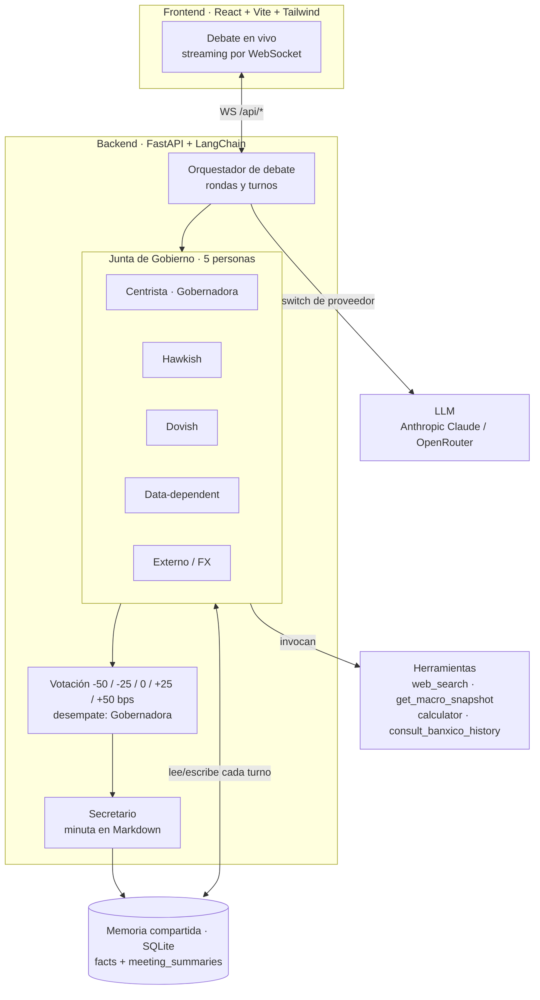

# Simulador de Debate Banxico


> Para detalle profundo de cómo funciona cada parte del proyecto (arquitectura, schema, protocolo WS, flujos, despliegue, operaciones), ver [`ARCHITECTURE.md`](./ARCHITECTURE.md).

Simulador multi-agente de la Junta de Gobierno del Banco de México.

- Cinco agentes con posturas distintas (centrista, hawkish, dovish, data-dependent, externo/FX) que debaten entre sí.
- Sistema de votación (-50, -25, 0, +25, +50 bps) con desempate por la Gobernadora.
- Generación automática de minutas en Markdown por un agente Secretario.
- Herramientas: `web_search` (Tavily), `get_macro_snapshot` (Banxico SIE + FRED + Yahoo Finance, con fallback estático), `calculator`, `consult_banxico_history` (minutas oficiales de Banxico mar-2026 y may-2026).
- Backend FastAPI + LangChain con switch Anthropic / OpenRouter.
- Frontend React + Vite + Tailwind con streaming por WebSocket.
- Tres modos: **Chat 1-a-1**, **Simulación de Junta** y **Mapa Mundial** (macro por país + petróleo + conflictos), con memoria persistente compartida (SQLite).
- **Multi-usuario**: login por persona con contraseña; el registro de chats y juntas es compartido y muestra quién creó cada uno.

## Arquitectura multi-agente



**Flujo:** el usuario define un escenario y contexto macro → el orquestador conduce el debate por turnos entre las cinco personas → cada agente carga su [memoria compartida](#memoria-persistente) e invoca herramientas (datos macro en vivo e historial oficial de Banxico) según necesite → se vota la decisión de tasa (con desempate de la Gobernadora) → el Secretario redacta la minuta y persiste un `meeting_summary` por agente. Todo el debate se transmite en vivo al frontend por WebSocket.

## Estructura

```
backend/   FastAPI + LangChain + SQLite
  app/data/banxico_history/   minutas oficiales en .md para consult_banxico_history
frontend/  React + Vite + Tailwind (ECharts vía CDN para el mapa)
Dockerfile + docker-compose.yml para despliegue
docker-compose.prod.yml + Caddyfile para producción con TLS
deploy.sh  script de despliegue con metadata de build inyectada
```

## Desarrollo local

### Backend

```bash
cd backend
python -m venv .venv && . .venv/bin/activate
pip install -e ".[dev]"
cp .env.example .env  # llena ANTHROPIC_API_KEY u OPENROUTER_API_KEY, y JWT_SECRET (openssl rand -hex 32)
uvicorn app.main:app --reload
```

Tests: `pytest -q`.

### Frontend

```bash
cd frontend
npm install
npm run dev
```

Vite proxyea `/api/*` (incluido WebSocket) al backend en `localhost:8000`.

## Endpoints (todos bajo `/api`)

- `POST /api/auth/register`, `POST /api/auth/login`, `GET /api/auth/me`
- `GET /api/agents`, `GET /api/agents/{id}`, `GET /api/agents/{id}/memory`
- `POST /api/chat/sessions`, `GET /api/chat/sessions`, `GET /api/chat/sessions/{id}/messages`, `DELETE /api/chat/sessions/{id}`, `WS /api/chat/ws/{id}?token=...`
- `POST /api/meetings`, `GET /api/meetings`, `GET /api/meetings/{id}`, `DELETE /api/meetings/{id}`, `WS /api/meetings/ws/{id}?token=...`
- `GET /api/world-map` — payload del mapa mundial: indicadores macro por país (World Bank), cuellos de botella del petróleo (EIA) y lista curada de países en conflicto.
- `GET /api/version` (sin auth) — commit SHA, fecha del commit y hora de build (inyectados por `deploy.sh`). Lo consume el badge del footer.
- `GET /health` (sin auth, para liveness probes).

Auth: header `Authorization: Bearer <token>` para HTTP; `?token=<token>` para WebSocket.

## Modo demo público ($0)

[](https://render.com/deploy?repo=https://github.com/dlfno/banxico-debate-sim)

Con `DEMO_MODE=true` el proyecto se despliega como una **URL pública funcional, sin API keys y sin costo**:

- La **Simulación de Junta** reproduce debates pre-generados (`backend/app/data/demo_meetings/`) con el mismo streaming por WebSocket que una junta real (turnos, votación, decisión con desempate de la Gobernadora, minuta), pero **sin llamar a ningún LLM**.
- El **chat 1-a-1** se deshabilita con un mensaje informativo (evita costo de LLM).

Deploy en un clic con el blueprint [`render.yaml`](./render.yaml) (Render → New → Blueprint → este repo). Arranca en `DEMO_MODE=true`. Para el modo real, pon `DEMO_MODE=false` y añade `PROVIDER` + la API key en el dashboard, y monta un disco persistente en `/app/data` para el SQLite.

## Provider y datos macro

`PROVIDER=anthropic|openrouter` en `.env`. Para OpenRouter, `MODEL` debe ser un slug de OpenRouter (ej. `anthropic/claude-sonnet-4.6`, `moonshotai/kimi-k2.6`).

`get_macro_snapshot` mezcla varias fuentes (cache de 5 min):

- **Banxico SIE** (requiere `BANXICO_TOKEN`): tasa objetivo, USD/MXN FIX, INPC general y subyacente, desempleo, Mezcla Mexicana SI744.
- **FRED St. Louis** (sin API key): Fed Funds rango superior, CPI USA YoY.
- **Yahoo Finance** (sin API key): WTI (`CL=F`) y Brent (`BZ=F`) front-month.
- **Snapshot estático de respaldo** al 9-may-2026 para CPI Eurozona, mercancías/servicios YoY, expectativas, PIB y meta de inflación, y para cualquier campo que falle en vivo.

Sin `TAVILY_API_KEY` la herramienta `web_search` devuelve un mensaje claro y los agentes siguen funcionando con el resto.

## Mapa Mundial

`GET /api/world-map` consulta el World Bank API (sin token, cache de 6 h) para cuatro indicadores por país: inflación anual (`FP.CPI.TOTL.ZG`), PIB en USD corrientes (`NY.GDP.MKTP.CD`), deuda externa total (`DT.DOD.DECT.CD`) y deuda pública como % del PIB (`GC.DOD.TOTL.GD.ZS`), tomando el último año con dato disponible por país (`mrnev=1`). El payload incluye además cuellos de botella del petróleo (cifras EIA) y una lista curada de países en conflicto con tres niveles de tensión. Si un valor no existe, queda en `null` — el frontend lo muestra como "—". Nunca se inventan cifras.

## Memoria persistente

Vive a nivel `agent_id` en `agent_memory` (kinds: `fact`, `meeting_summary`). Chat y junta comparten esta tabla, así que lo aprendido en una junta está disponible en chats posteriores y viceversa.

**Cuándo se escribe:**

- **Junta**: al final de cada junta se genera **un `meeting_summary` por agente participante** (100% de las juntas que lleguen al final). El resumen es en primera persona y queda asociado al `meeting_id`.
- **Chat 1-a-1**: cada **6 mensajes del usuario** se ejecuta una extracción ligera (`extract_facts`) que escribe hasta 3 `fact`s durables (preferencias, compromisos, datos clave). Conversaciones cortas (<6 turnos) no producen facts.

**Cuándo se lee:** cada turno del chat y cada turno del agente en una junta cargan el contexto completo del agente (últimos 10 facts + últimos 3 meeting_summaries) y lo inyectan como `SystemMessage` adicional al prompt — antes del system_prompt original de la persona.

**Observabilidad:** si la llamada al LLM extractor/sumarizador falla, el turno no se rompe (es best-effort) pero se registra con `logging.exception`. Revisa los logs de uvicorn si la memoria parece estancada.

**Tests automatizados**: `pytest tests/test_memory.py -v` cubre el contrato cruzado (chat→junta y junta→chat). El smoke `tests/test_debate_smoke.py` valida que cada agente reciba su propio summary tras una junta. El script `scripts/verify_shared_memory.py` corre el flujo end-to-end contra un backend vivo.

## Despliegue

El `Dockerfile` arma una sola imagen: stage 1 construye el frontend con `npm run build`, stage 2 lo empaca dentro de FastAPI como estáticos. La SPA queda en `/` y la API en `/api/*` en el mismo origen — no hay proxy ni CORS en producción.

```bash
# 1. Configura un .env en la raíz del repo con tus secretos:
echo "JWT_SECRET=$(openssl rand -hex 32)" > .env
echo "OPENROUTER_API_KEY=sk-or-..." >> .env
echo "TAVILY_API_KEY=tvly-..." >> .env      # opcional (web_search)
echo "BANXICO_TOKEN=..." >> .env            # opcional (snapshot macro en vivo)
# (PROVIDER, MODEL, ALLOW_REGISTRATION, CORS_ORIGINS tienen defaults sensatos)

# 2. Construye y lanza
docker compose up -d --build

# 3. Abre http://<host>:8000 desde cualquier máquina de la red
```

La SQLite vive en `./data/banxico.db` (volumen montado), así que sobrevive a `docker compose down`.

### Script `deploy.sh`

`./deploy.sh` (modo prod, default) o `./deploy.sh dev` hace `git pull`, captura el commit/fecha/hora de build y los pasa al `docker compose ... up -d --build` correspondiente. Esos valores quedan disponibles en `GET /api/version` y se muestran en el footer del sitio para saber qué commit está corriendo.

### LAN

Solo expón el puerto `8000` en tu red interna. Comparte la IP del host con tu equipo. Cada quien se registra desde la pantalla de login.

### Cloud (Railway/Fly/Render)

El mismo Dockerfile sirve. Configura las variables de entorno en el panel del proveedor (`JWT_SECRET`, `OPENROUTER_API_KEY`, etc.) y monta un volumen persistente en `/app/data` para SQLite. Si esperas más concurrencia, considera mover `DATABASE_URL` a Postgres (`pip install psycopg[binary]` y cambiar la URL).

### Producción en VPS con HTTPS (DigitalOcean + Caddy)

Setup con dominio propio (`banxico.dlf-no.com`) y TLS automático vía Let's Encrypt. Usa los archivos `Caddyfile` y `docker-compose.prod.yml` ya incluidos.

**1. Crear droplet en DigitalOcean.** Ubuntu 24.04 LTS, basic $6/mes (1 vCPU, 1 GB RAM). Sube tu llave SSH al crearlo.

**2. DNS en Cloudflare.** Agregar registro `A`:
- Name: `banxico`
- IPv4: IP del droplet
- Proxy status: **DNS only** (gris) — necesario para el ACME challenge inicial. Lo puedes cambiar a "Proxied" (naranja) después del primer cert.

**3. Setup inicial del droplet** (vía SSH):

```bash
ssh root@<droplet-ip>

# Crear swap de 1GB (recomendado en droplets de 1GB de RAM)
fallocate -l 1G /swapfile && chmod 600 /swapfile && mkswap /swapfile && swapon /swapfile
echo '/swapfile none swap sw 0 0' >> /etc/fstab

# Firewall: solo SSH, HTTP, HTTPS
ufw allow 22/tcp && ufw allow 80/tcp && ufw allow 443/tcp && ufw --force enable

# Instalar Docker
curl -fsSL https://get.docker.com | sh

# Clonar el repo
git clone https://github.com/<tu-org>/banxico_V3.git /opt/banxico
cd /opt/banxico
```

**4. Configurar `.env` en el servidor:**

```bash
cat > .env <<EOF
JWT_SECRET=$(openssl rand -hex 32)
PROVIDER=openrouter
MODEL=anthropic/claude-sonnet-4.6
OPENROUTER_API_KEY=sk-or-...
TAVILY_API_KEY=tvly-...
BANXICO_TOKEN=...
CORS_ORIGINS=https://banxico.dlf-no.com
ALLOW_REGISTRATION=true
EOF
chmod 600 .env
```

**5. Levantar la app + Caddy:**

```bash
./deploy.sh    # equivale a: docker compose -f docker-compose.prod.yml up -d --build
```

Caddy detecta el dominio en el `Caddyfile`, hace el ACME challenge (HTTP-01) y emite el cert TLS automáticamente. Tarda ~30 segundos la primera vez.

**6. Verificar:**

```bash
curl -I https://banxico.dlf-no.com/health        # 200 con TLS válido
curl    https://banxico.dlf-no.com/api/version   # commit SHA y build time
docker compose -f docker-compose.prod.yml logs -f caddy   # ver progreso del cert
```

Abre `https://banxico.dlf-no.com` en el browser y registra el primer usuario.

**Cierre del registro:** una vez que el equipo esté dentro, edita `.env` (`ALLOW_REGISTRATION=false`) y reinicia con `docker compose -f docker-compose.prod.yml restart app`.

**Updates:** `./deploy.sh` desde el droplet — hace `git pull` + rebuild con metadata fresca. Caddy reusa el cert (vive en el volumen `caddy_data`).

**Backups de SQLite:** archivo único en `/opt/banxico/data/banxico.db`. Para backup automático a tu máquina local, un cron del lado tuyo:

```bash
# en tu máquina local, en crontab -e
0 4 * * * scp root@<droplet-ip>:/opt/banxico/data/banxico.db ~/backups/banxico-$(date +\%F).db
```

**Cloudflare proxy ON (opcional, después del primer cert):** vuelve a Cloudflare DNS, cambia el registro a "Proxied" (naranja). Te da CDN, DDoS y oculta la IP del droplet. SSL/TLS mode en Cloudflare debe ser **Full (strict)** porque Caddy ya tiene cert válido de Let's Encrypt.

### Cerrar el registro abierto

Por defecto cualquiera puede crearse cuenta (`ALLOW_REGISTRATION=true`). Una vez que tu equipo esté dentro, pon `ALLOW_REGISTRATION=false` y reinicia para bloquear nuevos registros.
